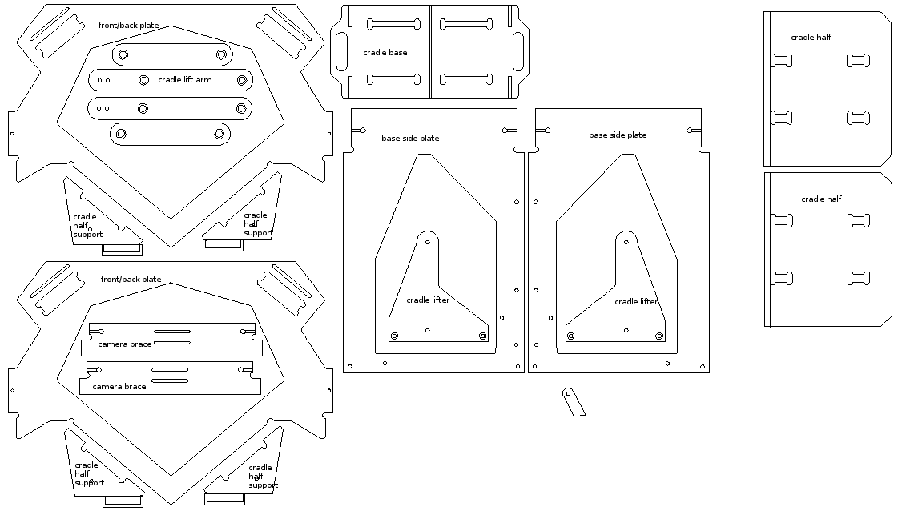

# Bill of materials

## Wooden parts

* 4x black wooden pulley

## Metal parts
* 10x bolt M8 black 50 mm, button head
* 2x bolt M8 black 70 mm, button head
* 16x M8 nut black
* 30x M8 washer black
* 12x screw 16 mm
* 2x M8 rod 17cm
* 4x M8 wing nut
* 2x bolt UNC 1/4” 25mm
* 20x bearing 608ZZ 8 x 22 x 7 mm
* 8x cross dowel
* 8x furniture screw M6x50
* 2x threaded rod M6x740mm
* 2x threaded rod M6x730mm
* 1x threaded rod M8 830mm
* 4x big washer
* 8x furniture cap nut M6

## Aluminium
* 2x aluminium profile 914mm 
* 2x aluminium profile 600mm 
* 1x aluminium round tube 734mm
* 2x aluminium square tube 25*696mm
* 2x aluminium square tube 30*694mm

## Tube inserts
* 4x 25mm M8
* 4x 30mm M8
* 2x M10

## Light module
* 2x foamboard trapezoid
* 2x foamboard 381x406 mm
* 1x foamboard 101x406 mm with LED lighting preinstalled
* 2x foamboard 406x153 mm
* 1x LED power supply

## Glass
* 2x tempered glass (50 degree angle, taped with electric tape)

## Various
* 2x felt strip black 200mm
* 4x black elastic cord 45cm
* (electric tape)

## Electronics (standalone and deluxe kit only)
* 2x Canon camera (one labeled “odd” and one labeled “even”)
* 2x A-brand SD card (CHDK firmware preconfigured)
* 2x mini USB cable
* 1x micro USB cable
* 2x camera AC adapter
* 1x USB foot pedal
* 1x USB hub (powered)
* 1x Raspberry pi B+
* 1x Raspberry pi B+ case
* 1x micro SD card (preconfigured for spreads)
