(See also: BOM and tools) 

## Assembling the base
### Preparing the aluminium tubes
You will need:
* 2x aluminium square tube 30x710mm
* 4x metal tube inserts 32x8x1.2mm  
* 2x aluminium square tube 25x710mm
* 4x metal tube inserts 25x8x1.2mm  
* rubber hammer

Separate the 30mm tubes and inserts from the 25mm tubes and inserts. Bang the tube inserts into both sides of both aluminium tubes using the rubber hammer. This requires some force. 

### Assembling the base side plates
You will need:
* 2x base side plate
* 4x M8x50 bolts
* assembled 30x30mm aluminium tubes (see previous step)
* 1x allen key M5

Assemble the base by screwing M8x50 bolts into tube inserts. (Sorry about the bad picture from a test build.)

### Mounting the pulleys onto the base side plates
You will need:
* 2x bolt M8 50mm
* 4x plastic pulley
* 2x nut M8
* allen key M5

Put together as seen in the pictures below. From outside to inside:
* bolt head
* plastic pulley
* nut
* base side plate
* nut
* plastic pulley
* nut

### Assembling the cradle frame
You will need:
* 2x aluminium square tube 25x25x2mm 711mm
* 4x metal tube insert 25mm M8
* 4x bolt M8x50mm
* 2x cradle lifter
* allen key M5

The process is similar to the assembly of the base frame.

First bang the metal tube inserts into the aluminium tubes, like you did with the base frame. Hint: it may help to do this upside down, as pictured.
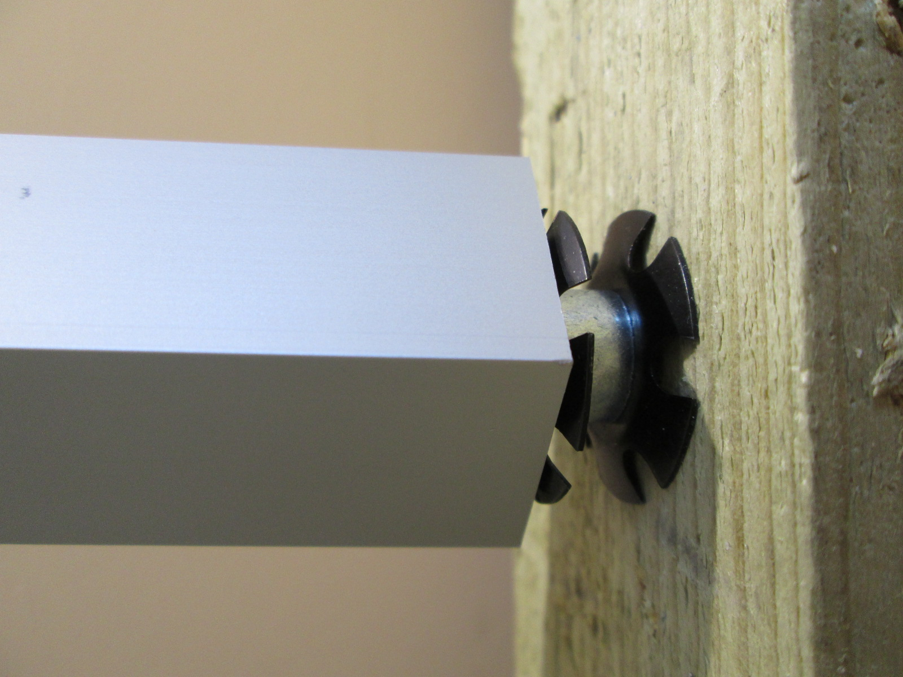

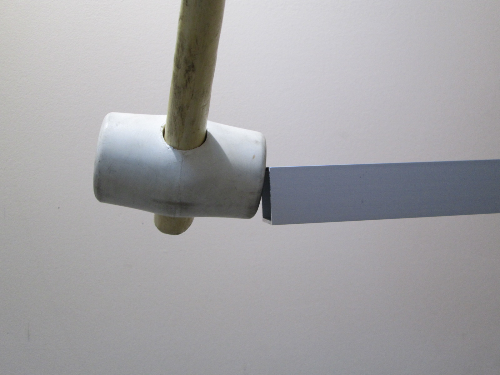

Now add the both cradle lifters to the assembly. Fasten all four M8x50 bolts. (Sorry about the bad picture from a test build.
")

### Base pulley bolts
You will need:
* 2x bolt M8 50mm
* 2x nut M8
* allen key M6

Screw one bolt halfway through each side plate. Keep the bolt head on the outside of the frame. Screw a nut onto the bolt at the inside of the frame.

### Cradle frame in base frame
Move the cradle frame inside the base frame. **Watch the orientation!**

### Preparing the cradle lift arms
You will need:
* 2x long cradle lift arm
* 2x short cradle lift arm
* 16x bearing
* 8x bolt M8 50mm
* 1x nut M8
* allen key M6
* wrench M8

Push two bearings each into both sides of all four cradle lift arms, for sixteen bearings in total. Use an M8 bolt and nut as pictured. Afterwards, unscrew the nut. Leave the eight bolts inserted.

### Mount the cradle lift arms
You will need:
* assembled cradle lift arms
* 8x washer M8
* 8x nut M8
* allen key M6
* wrench M8

Put a washer on every lift arm bolt.

Bolt the lift arms to cradle lifters and side plates. Screw an M8 nut onto every lift arm bolt.

### Preparing the hand grip tube
You will need:
* 1x Aluminium roundtube 38x2x748mm
* 2x Tube inserts 38x8mm 
* 2x eyebolt M5x40m;
* 2x M5 cap nuts  
* rubber hammer

Bang round tube inserts into round tubes
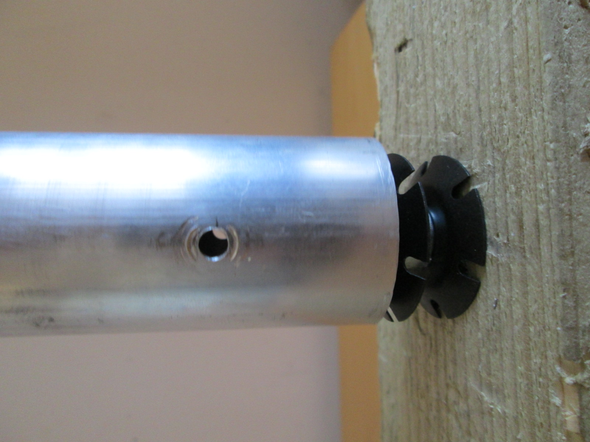
Hint: it may help to do this upside down, as pictured.

Attach both eyebolts and capnuts on both sides of roundtube
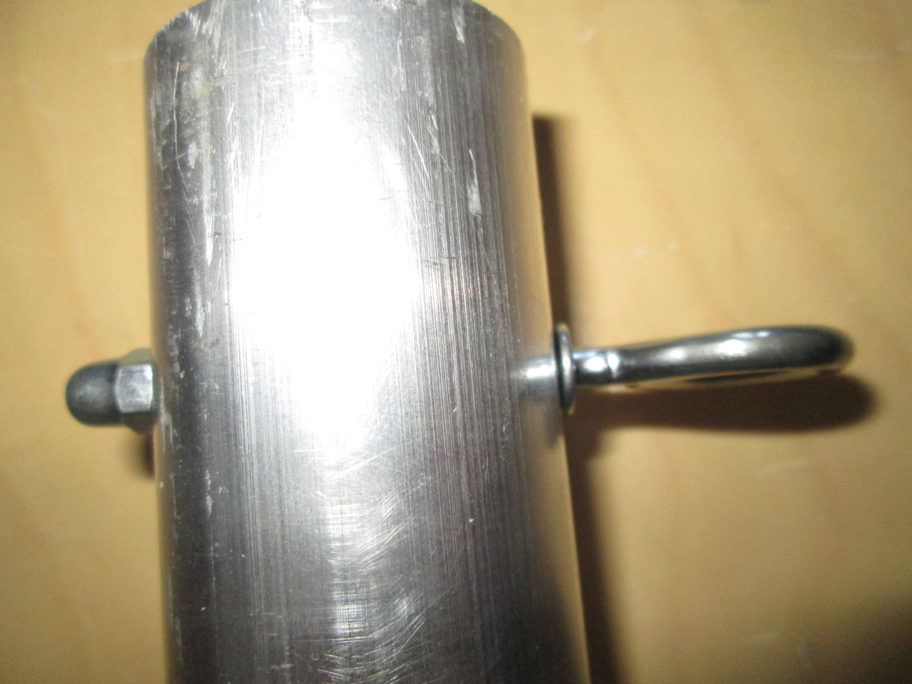

### Mounting the hand grip tube
You will need
* assembled hand grip tube
* 2x washer M8
* 2x nut M8
* 2x M8x40 bolts
* 2x M8x35 or M8x40

Mount the hand grip tube between the lift arms. Attach it to lift arm  with M8 washer and M8x40 bolt
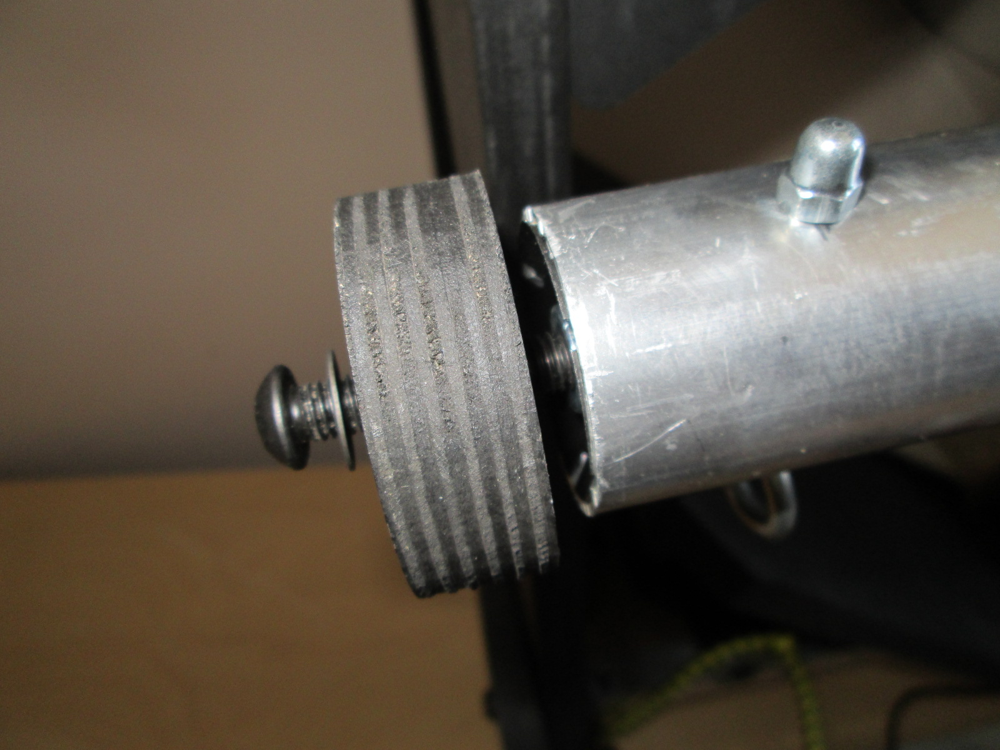

## Assembling the glass module
### Front and back plate meet camera braces
You will need:
* front plate
* back plate
* 2x camera brace
* rubber hammer

Assemble the front and back plate and the camera braces as pictured. This might require some force from the rubber hammer. Don't worry about damaging the wood. This is super strong birch plywood!

The result should look like this.

### Screw front and back plate and camera braces together
You will need:
* assembled glass module
* 4x cross dowel
* 4x furniture bolt
* allen key M6
* flat head screwdriver
* allen wrench M6

**The flat head screw side facing outwards**, insert the cross dowels into the holes in the camera braces. Push the furniture bolts through the front and back slot plates. Adjust the cross dowel angle alignment to the the furniture bolt with a flat head screwdriver. Screw the furniture bolts into the cross dowels.

### Preparing the glass plates
You will need:
* 2x glass plate
* paper tape

Put the two glass plates onto a flat surface. They should meet with the angled cut facing down.

Tape the two glass plates together with bits of paper tape or other kind of tape that is easy to clean. Six or seven should do.

### Installing the glass plates
You will need:
* prepared glass plates
* assembled optics module
* 2x aluminium L profile 600mm
* 12x short wood screw
* electric drill or screwdriver
* drill bit wood 3mm

Lay the glass on the optics module as shown **with the angle cut pointing down**. Gently fold both aluminum profiles around the corners where glass and front/back plate meet.

Using a 3mm wood drill bit, and with the holes in the aluminium profiles as a guid, predrill twelve holes for the wood screws in the front/back plate.

Now we are ready to fix the glass plates to the glass module. Screw twelve screws into the predrilled holes. **Do not screw them in too tight yet!**

## Mounting the glass module onto the base module
You will need:
* assembled optics module
* assembled base module
* 4x cross dowel
* 4x furniture bolt M6

Install the optics module on top of the base module.

Fasten both modules to eachother with four cross dowels and furniture bolts.

Tighten the wood screws.

Remove unnecessary electric tape. Use a cutter knife to remove the unnecessary bits around the edges.

## Cradle
### Prepare the cradle wheels
You will need:
* 4x bolt black M8 50mm
* 4x washer M8
* 4x F608ZZ bearing

Put 4 sets together as pictured.

### Assemble the cradle base
You will need:
* 4x cradle wheel from previous step
* cradle base
* rubber hammer

Push the prepared cradle wheel bolts into the cradle base holes. Use a rubber hammer if needed.

### Assemble the cradle leaves
You will need:
* 2x cradle leave
* 4x cradle leave triangles
* rubber hammer

Hammer the cradle leave triangles into the underside of the cradle leaves. **Have the thin sides of the cradle leave triangles facing eachother!**

### Mount the assembled cradle leaves onto the cradle base

### Fix cradle leaves onto base
You will need:
* 2x threaded rod M8 or M6 170mm
* 4x wing nut M8 or M6
* cradle

Fix the cradle leaves to the base with the threaded rods and the wing nuts.

### Put cradle onto cradle runners

### Hook up the bungee cords
Hook two shortest inside and outside of scanner

## Light module
### Assemble light module
You will need:
* all black foam board
*6x M3x18 bolts
*6x M3 washers     
*6x M3 nuts
*2x M5x15 bolts DIN 7985
*2x M5 nuts;             
*4x M5 washers
*4x PS light diffuser 50x50mm
*2x SORAA LED lights
*2x Lamp Socket
*1x Screw terminal 

Put all foamboard part together as shown in picture. No glue needed.
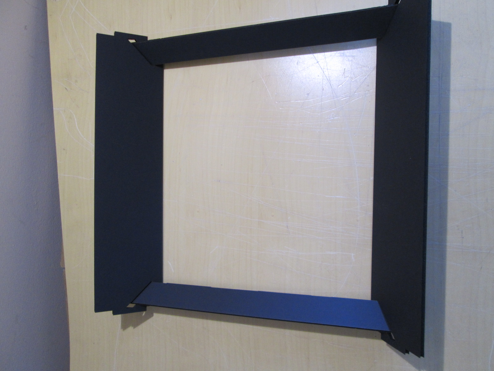
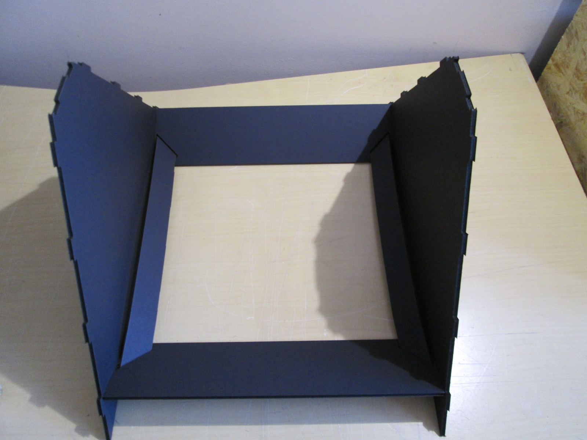
Easier to handle when light module in on the book scanner already.
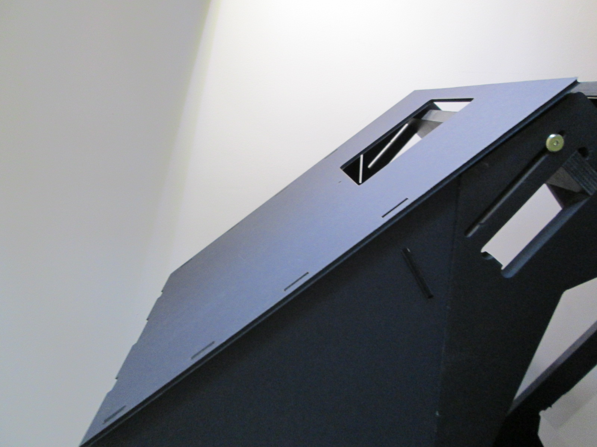

Put it all together M5x15 bolt, M5 washer, foamboard camera lid, foamboard side panel, M5 washer, M5 nut.
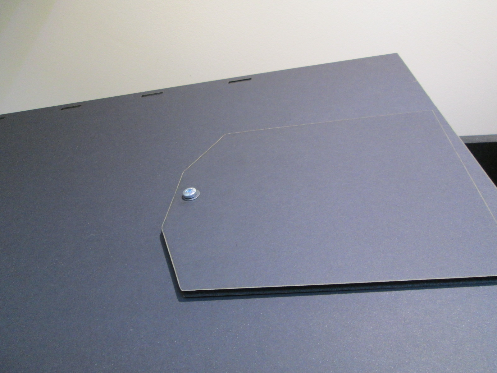

Remove protective tape from PS light diffusers and use one with vertical and one with horizontal pattern for each bulb.
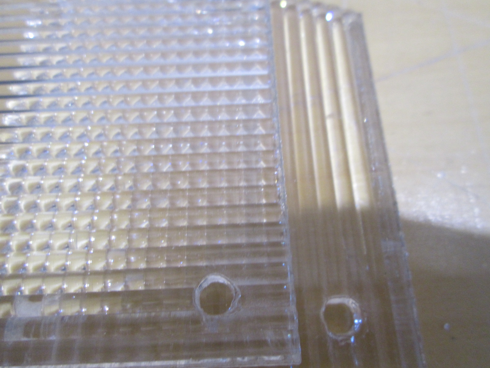

Attach lamp socket with optics to the top panel. 
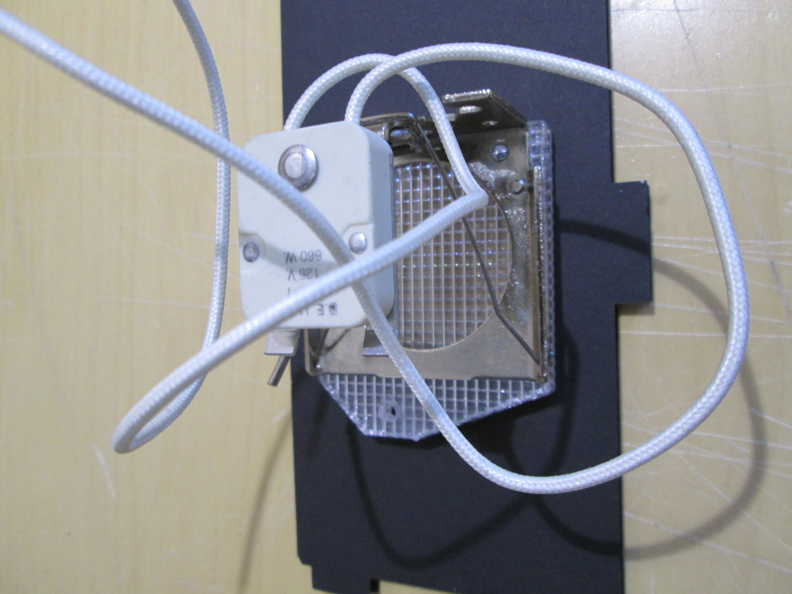
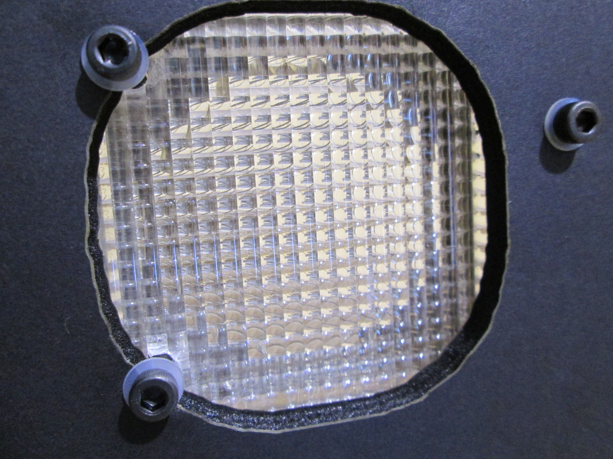

Put it all on top of book scanner

Connect power cables with screw terminal
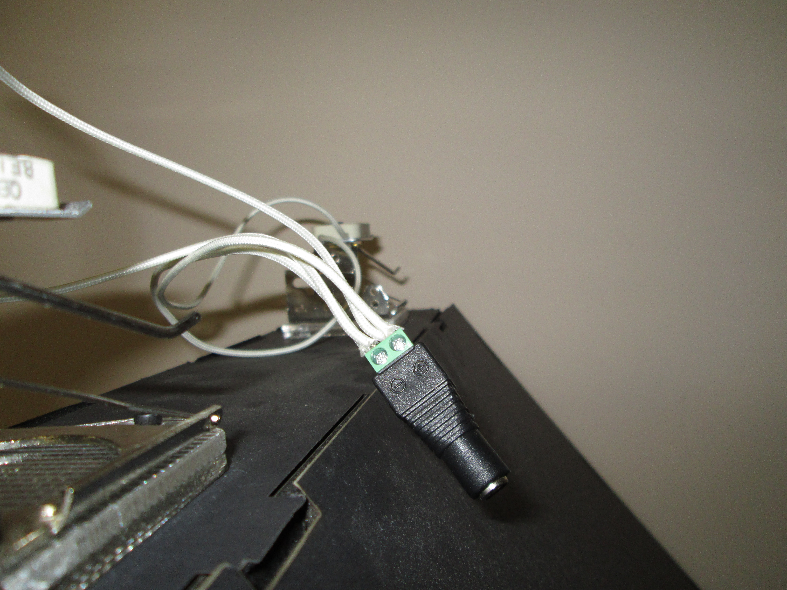

Insert both light bulbs and connect the LED module to the DC power supply.

## Mount cameras and electronics
### Mount cameras
You will need:
* cameras
* camera power supplies
* 4x washer M8
* 2x bolt UNC
* (optional) zip ties

### Connect electronics
You will need:
* 1x raspberry pi (model b+ or 2)
* 1x micro usb cable
* 2x mini usb cable long black
* 1x usb hub powered 2A
* 1x usb foot pedal

* Connect the usb hub to the mains power.
* Connect the micro usb cable to the usb hub and the raspberry pi.
* Connect the usb hub to the raspberry pi using the usb cable that comes with it.
* Connect the cameras to the usb hub using the mini usb cables.
* Connect the foot pedal directly to the raspberry pi.
