(See also: BOM and tools) 

## Assembling the base
### Preparing the aluminium tubes
You will need:
* 2x aluminium square tube 30x710mm
* 4x metal tube inserts 32x8x1.2mm  
* 2x aluminium square tube 25x710mm
* 4x metal tube inserts 25x8x1.2mm  
* rubber hammer

Separate the 30mm tubes and inserts from the 25mm tubes and inserts. Bang the tube inserts into both sides of both aluminium tubes using the rubber hammer. This requires some force. 

### Assembling the base side plates
You will need:
* 2x base side plate
* 4x M8x50 bolts
* assembled 30x30mm aluminium tubes (see previous step)
* 1x allen key M5

Assemble the base by screwing the furniture cap nuts onto the threaded rod. (Sorry about the bad picture from a test build.)

### Mounting the pulleys onto the base side plates
You will need:
* 2x bolt M8 50mm
* 4x plastic pulley
* 2x nut M8
* allen key M5

Put together as seen in the pictures below. From outside to inside:
* bolt head
* plastic pulley
* nut
* base side plate
* nut
* plastic pulley
* nut

### Assembling the cradle frame
You will need:
* 2x aluminium square tube 25x696mm
* 4x tube insert 25mm M8
* 4x furniture cap nut M6
* 2x cradle lifter
* 2x threaded rod M6 730mm
* allen key M6

The process is similar to the assembly of the base frame.

First push two furniture cap nuts each into both cradle lifters.

Now fasten the threaded rods into the furniture cap nuts in one cradle lifter. Do not fasten them too tightly yet.

Push the aluminium tubes onto the threaded rods.

Now add the second cradle lifter to the assembly. Fasten all four furniture cap bolts to the threaded rods.

### Base pulley bolts
You will need:
* 2x bolt M8 50mm
* 2x nut M8
* allen key M6

Screw one bolt halfway through each side plate. Keep the bolt head on the outside of the frame. Screw a nut onto the bolt at the inside of the frame.

### Cradle frame in base frame
Move the cradle frame inside the base frame. **Watch the orientation!**

### Preparing the cradle lift arms
You will need:
* 2x long cradle lift arm
* 2x short cradle lift arm
* 16x bearing
* 8x bolt M8 50mm
* 1x nut M8
* allen key M6
* wrench M8

Push two bearings each into both sides of all four cradle lift arms, for sixteen bearings in total. Use an M8 bolt and nut as pictured. Afterwards, unscrew the nut. Leave the eight bolts inserted.

### Mount the cradle lift arms
You will need:
* assembled cradle lift arms
* 8x washer M8
* 8x nut M8
* allen key M6
* wrench M8

Put a washer on every lift arm bolt.

Bolt the lift arms to cradle lifters and side plates. Screw an M8 nut onto every lift arm bolt.

### Preparing the hand grip tube
You will need:
* aluminium round tube
* round tube inserts
* threaded rod 830mm
* rubber hammer

Bang the round tube inserts into both sides of the aluminium round tube.

Push the threaded rod through the tube with the ends out on both sides.

### Mounting the hand grip tube
You will need
* assembled hand grip tube
* 2x washer M8
* 4x nut M8

Mount the hand grip tube between the lift arms. Push the threaded rod through the mount holes in both lift arms.

On both sides of the threaded rod, first push on a washer, then screw on two nuts. Leave some space between the nuts. This is where we will attach the bungee cords later.

## Assembling the glass module
### Front and back plate meet camera braces
You will need:
* front plate
* back plate
* 2x camera brace
* rubber hammer

Assemble the front and back plate and the camera braces as pictured. This might require some force from the rubber hammer. Don't worry about damaging the wood. This is super strong birch plywood!

The result should look like this.

### Screw front and back plate and camera braces together
You will need:
* assembled glass module
* 4x cross dowel
* 4x furniture bolt
* allen key M6
* flat head screwdriver
* allen wrench M6

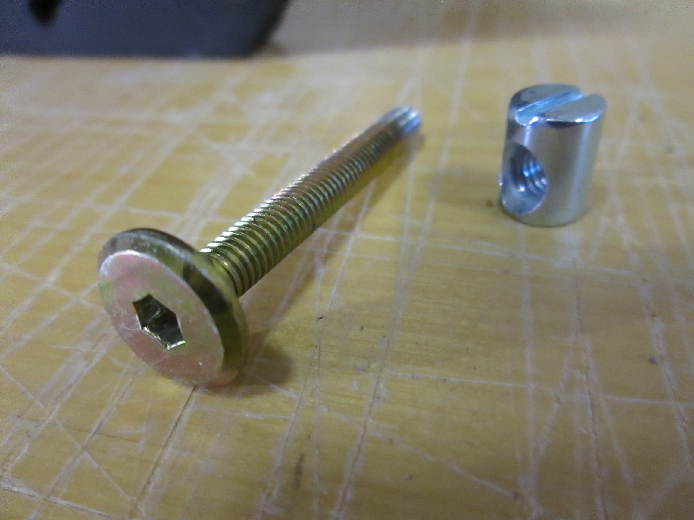

**The flat head screw side facing outwards**, insert the cross dowels into the holes in the camera braces. Push the furniture bolts through the front and back slot plates. Adjust the cross dowel angle alignment to the the furniture bolt with a flat head screwdriver. Screw the furniture bolts into the cross dowels.

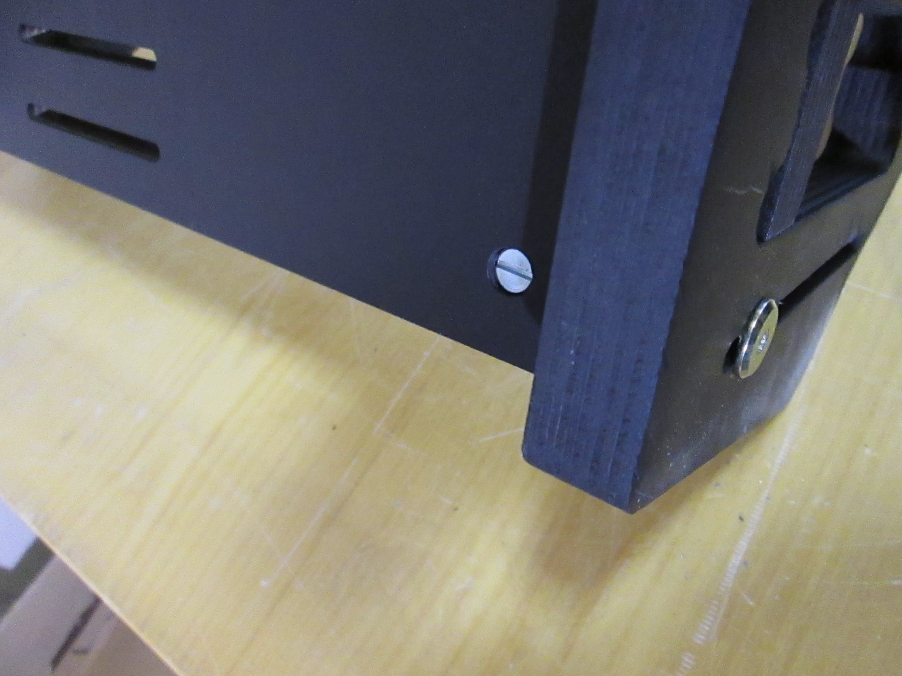

### Preparing the glass plates
You will need:
* 2x glass plate
* electric tape

Put the two glass plates onto a flat surface. They should meet with the angled cut facing down.
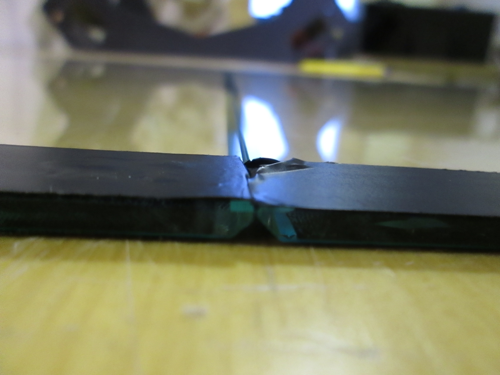

Tape the two glass plates together with bits of electric tape. Six or seven should do.
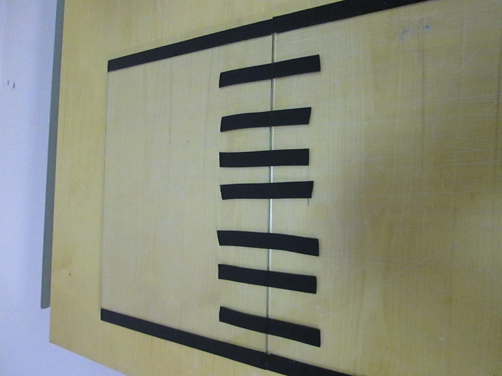

### Installing the glass plates
You will need:
* prepared glass plates
* assembled optics module
* 2x aluminium L profile 600mm
* 12x short wood screw
* electric drill or screwdriver
* drill bit wood 3mm

Lay the glass on the optics module as shown **with the angle cut pointing down**. Gently fold both aluminum profiles around the corners where glass and front/back plate meet.

Using a 3mm wood drill bit, and with the holes in the aluminium profiles as a guid, predrill twelve holes for the wood screws in the front/back plate.

Now we are ready to fix the glass plates to the glass module. Screw twelve screws into the predrilled holes. **Do not screw them in too tight yet!**

## Mounting the glass module onto the base module
You will need:
* assembled optics module
* assembled base module
* 4x cross dowel
* 4x furniture bolt M6

Install the optics module on top of the base module.
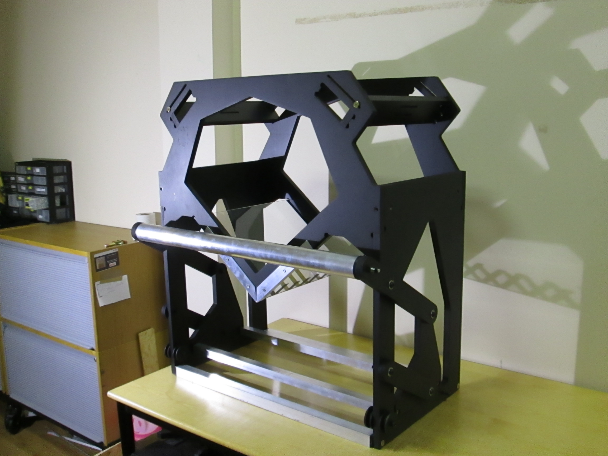

Fasten both modules to eachother with four cross dowels and furniture bolts.

Tighten the wood screws.
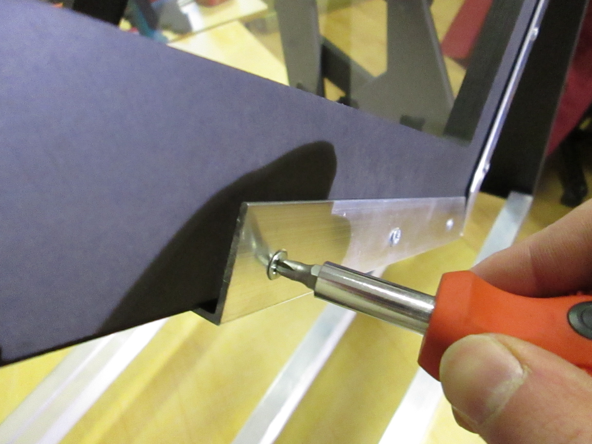

Remove unnecessary electric tape. Use a cutter knife to remove the unnecessary bits around the edges.
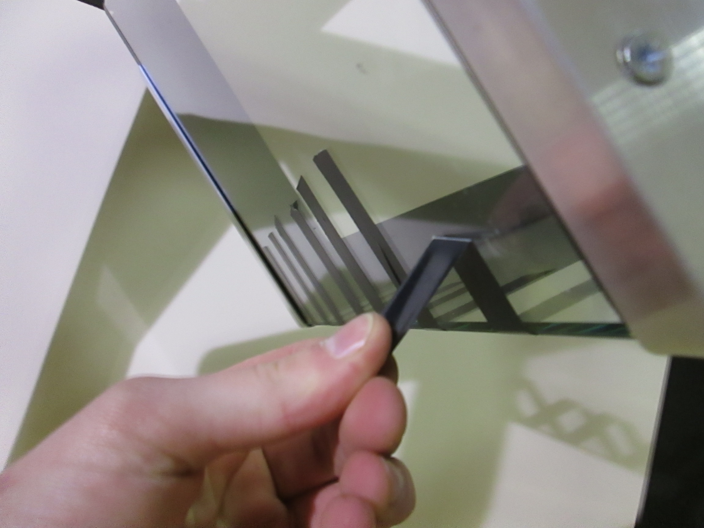

## Cradle
### Prepare the cradle wheels
You will need:
* 4x bolt black M8 50mm
* 4x washer M10
* 8x washer M8
* 4x bearing

Put 4 sets together as pictured.

### Assemble the cradle base
You will need:
* 4x cradle wheel from previous step
* cradle base
* rubber hammer

Push the prepared cradle wheel bolts into the cradle base holes. Use a rubber hammer if needed.
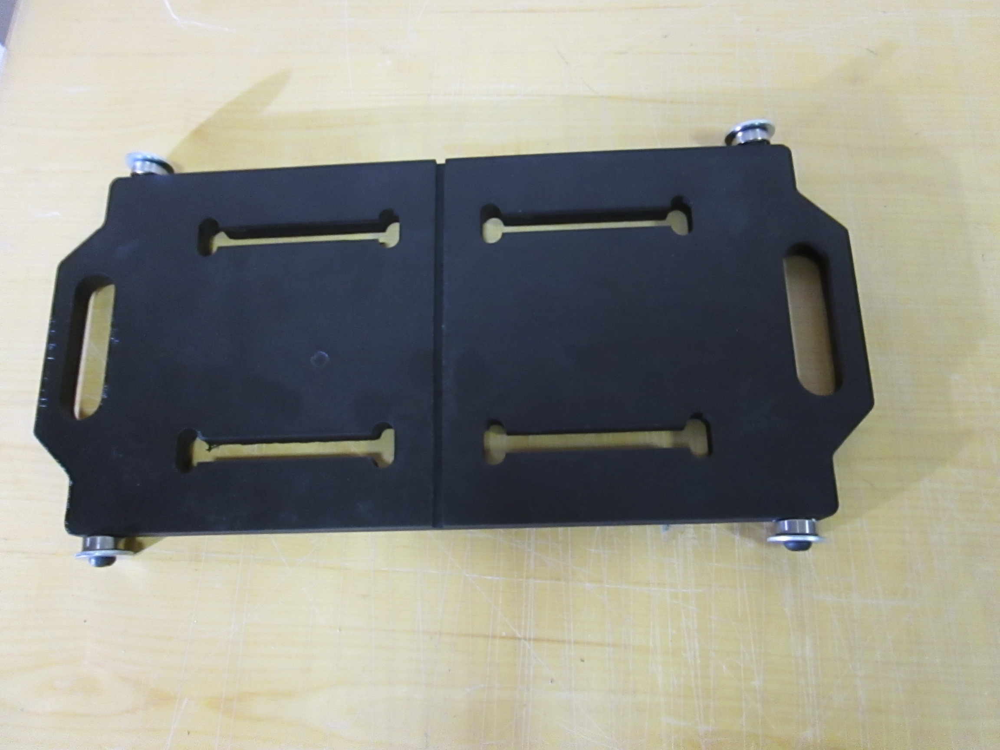

### Assemble the cradle leaves
You will need:
* 2x cradle leave
* 4x cradle leave triangles
* rubber hammer

Hammer the cradle leave triangles into the underside of the cradle leaves. **Have the thin sides of the cradle leave triangles facing eachother!**
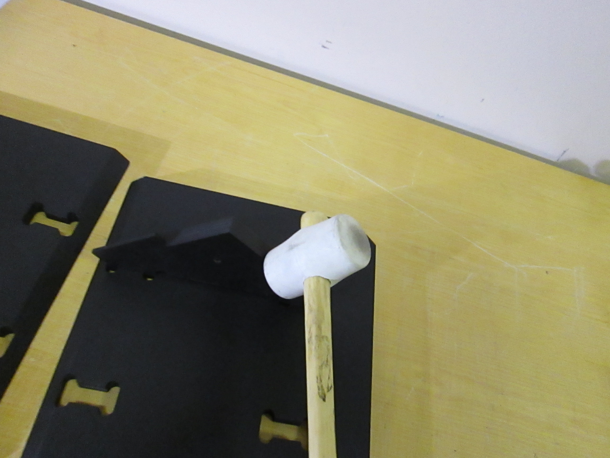

### Mount the assembled cradle leaves onto the cradle base

### Fix cradle leaves onto base
You will need:
* 2x threaded rod M8 170mm
* 4x wing nut M8
* cradle

Fix the cradle leaves to the base with the threaded rods and the wing nuts.

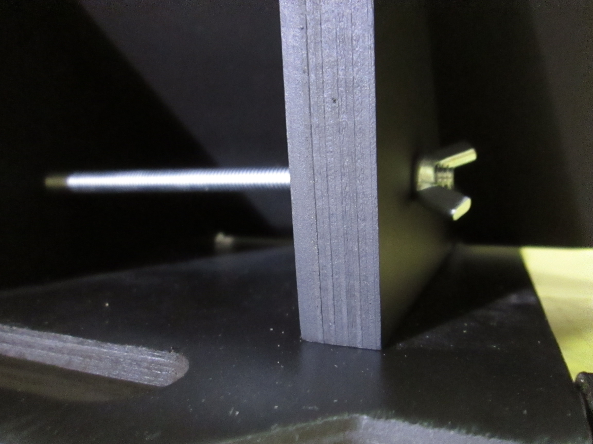

### Put cradle onto cradle runners

### Hook up the bungee cords

## Light module
### Assemble light module
You will need:
* all black foam board
* hot glue, superglue or 2 component epoxy
* 2x aluminium profile 914mm

Fold the aluminium profiles around the foam board trapezoids as pictured.

Glue the aluminium to the foam board. Glue the top part first, then the sides. Let the LED lighting DC cable escape from the edge of the light module board. (Note that the imperfect cuts in this prototype have been improved. Foam board is now laser cut.)

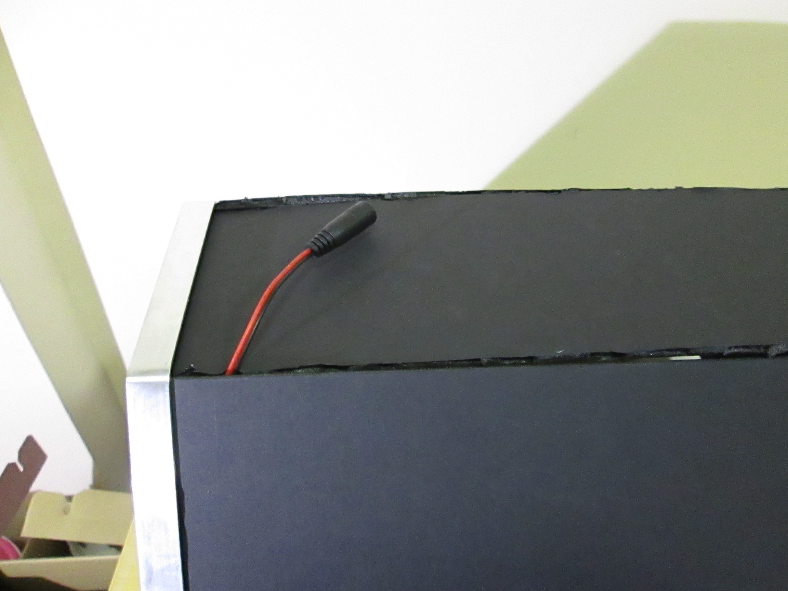

### Mount light module to optics module
Put the light module on top of the optics module.

Reduce glare with two pieces of foamboard on top of the optics module.
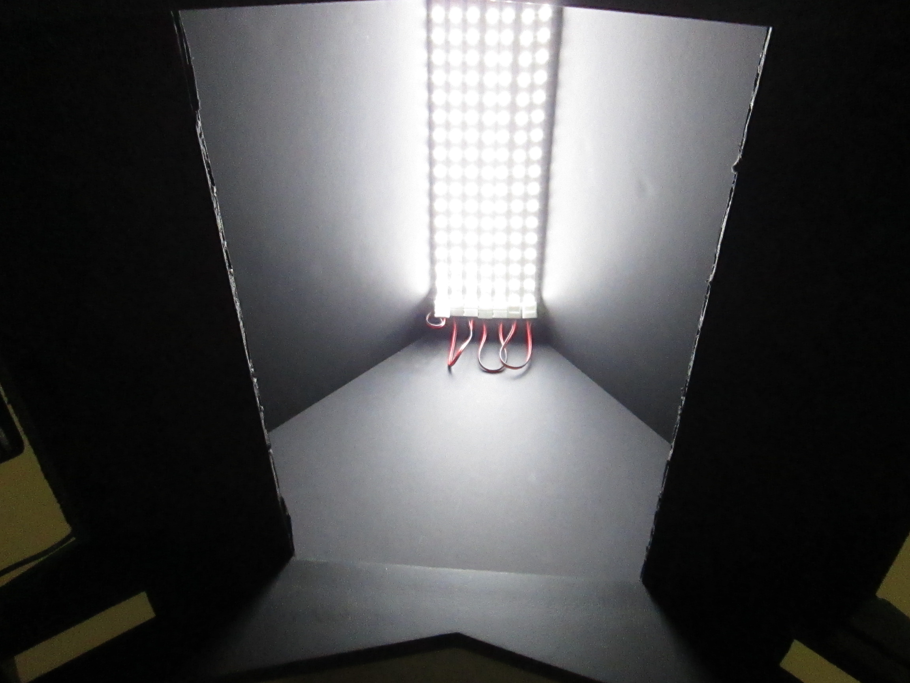

Connect the LED module to the DC power supply.

## Mount cameras and electronics
### Mount cameras
You will need:
* cameras
* camera power supplies
* 4x washer M8
* 2x bolt UNC
* (optional) zip ties

### Connect electronics
You will need:
* 1x raspberry pi (model b+ or 2)
* 1x micro usb cable
* 2x mini usb cable long black
* 1x usb hub powered 2A
* 1x usb foot pedal

* Connect the usb hub to the mains power.
* Connect the micro usb cable to the usb hub and the raspberry pi.
* Connect the usb hub to the raspberry pi using the usb cable that comes with it.
* Connect the cameras to the usb hub using the mini usb cables.
* Connect the foot pedal directly to the raspberry pi.
